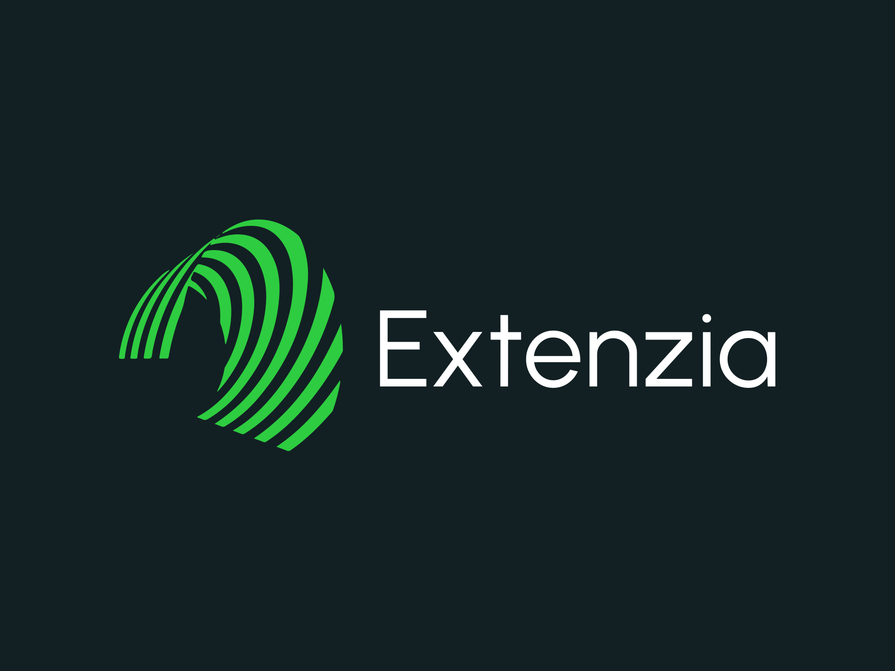

# Extenzia

**Extenzia** is an open-source collective building modern, privacy-respecting Chrome extensions to make the web more productive, customizable, and user-friendly.

### 🌟 What We Do
We focus on:
- ✨ Chrome extensions that improve daily workflows
- 🎯 Tools for media handling, automation, and accessibility
- 💡 Minimal, fast, and thoughtfully designed UIs
- 🔓 100% open-source, under permissive licenses

### 🤝 Why Join Us?
We believe in:
- Clean code, clear UX
- Transparent collaboration
- Respecting user privacy
- Building in public

### 🛠️ Current Projects
- 📏 **MediaMeter** – Show image/video sizes on web pages
- 📥 **SnapSave** – One-click download tools for embedded content
- 🔍 **HoverLens** – Visual inspection overlays for web elements

> We’re just getting started. Fork, contribute, or just star us 🌟 to stay updated.

---

**Built by devs who love the browser.  
Run by the community. Powered by open-source.**
✅ Short & Sharp
Building open-source Chrome extensions for better browsing — simple, fast, and free.

🎯 Developer-Friendly
Extenzia creates browser extensions that solve real-world problems with clean code, clear UX, and open collaboration.

🌐 Community-Centric
Join us in building browser tools that respect users, embrace transparency, and put the web back in your hands.
